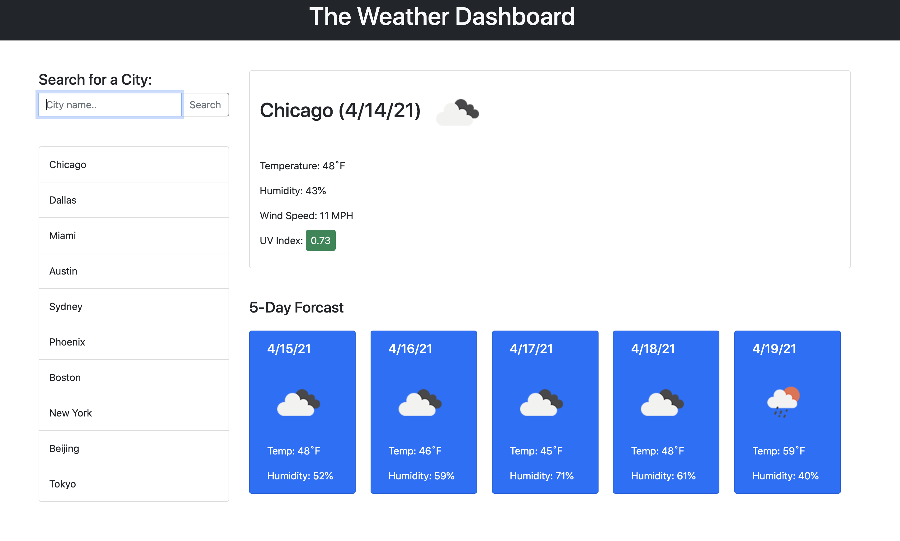
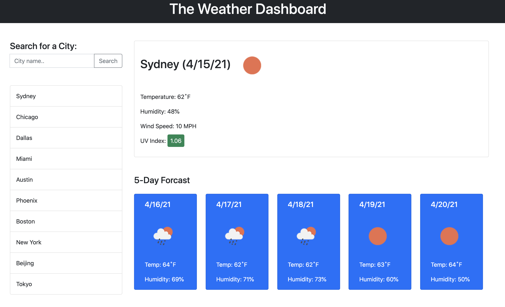

# MyLocalWeather
A simple weather app which works with the OpenWeather API.

Author: Tomasz Siemion
Project: My Local Weather
LINK: https://rotosti.github.io/MyLocalWeather/

The weather apps goal is to take a user entered city, get the current weather, 5 day forecast, and store the searches in a search history.

The user will enter in the name of the city and the web app will link to the OpenWeather API to get current weather conditions.  The initial API request is sent to get the coordinates of the location.  The cordinates will then fuel a 2nd API call which gathers more complete data that the first API call will not be able to provide.  The 2nd API call fills out a weather data object which stores the date, the image provided by the API, the alt text, the current temperature, humidity, wind speed, UV index, 5-day forecast, and name of the city.

After the data is gathered, there is another function which is trigged by the 2nd API call which updates the cards on the web page to display the data.  It is a 3 step process and will only be completed once there are successful server responses from the API calls.

A user can click on the recent searches and the search will be completed again.

The searches are also stored in a search history which uses local storage to be persistant. When a user enters a city and submits, the city search is put in a search array which gets processed and reloaded on the web app dynamically.  Repeat searches of the same city will just bring the city to the top of the list, and will remain unique.  Duplicates are not allowed.  The update function checks for duplicates using .include() array method.  If there is a duplicate, it will .splice() and then .unshift() to add the city to the "front" of the array. Then the information is immediately updated in local storage.

If the page is refreshed, there is an initialization function which will check local storage and refresh the search history on the screen.

